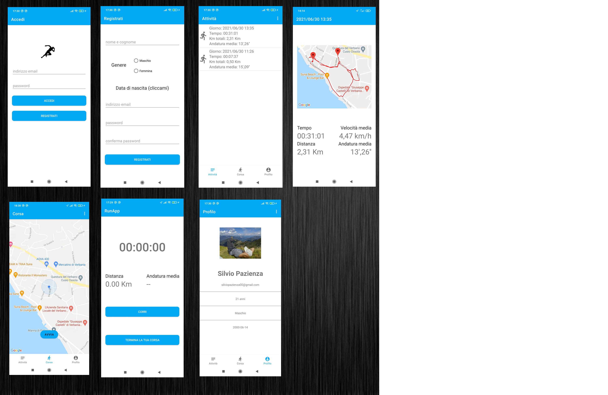

# RunApp - Your running companion
## What is RunApp

Application for monitoring your running sessions. Registered users have the
ability to save your rides and view the related information in detail.
The session is saved if the user travels at least 100m.

We used the Firebase service as an architecture for saving and managing data.   

## Firebase services used
- Firebase Authentication: user credential management (Provider: e-mail and password). 
- Firebase Firestore database: collection of users and running sessions. 
- Firebase Storage: service to store users' profile photos. 
- Firebase Crashlytics: service for monitoring crashes that can happen to users during use. 
- Firebase Analytics: user monitoring service. 

## Application functionality:

- Sign in with e-mail and password
- Sign up with e-mail and password
- Activities section showing the running sessions you have taken grouped in a list
- Running session monitoring (km calculation, average pace calculation, stopwatch, coordinates saving)
- User profile section
- Saving sessions in a dedicated collection (visible only to the user who supported it)
- View your current location on Google Maps
- Ability to change your information (name and surname, gender, e-mail, password)
- Possibility to log out
- Supported languages: English and Italian
- Ability to show in detail a specific session supported with a map showing the track.
- Ability to set profile picture.

## Permission lists the app will ask for:

- Access permission to the current location (without this permission, the app will not be able to start a running session)
- User gallery access permission to set a profile picture.

## Altre informazioni

- The app needs Google Play Service for the use of Firebase and Google Maps.
- The theme is not dynamic (light mode only).
- The GPS must necessarily be active, otherwise it will not be possible to monitor the ride correctly.
- For Xiaomi users it will be necessary to go to settings -> app -> RunApp -> battery saver and disable the restrictions of MIUI.
- During a session, the user can browse other applications and be monitored in the background.
- The user must remember the login credentials (there is no password recovery or email recovery).

